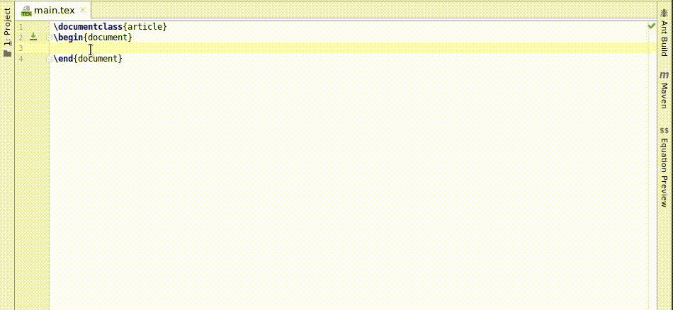

# TeXiFy settings

These settings can be found in <ui-path>File | Settings | Languages & Frameworks | TeXiFy</ui-path>

## Option to disable automatic insertion of second $

By default, when you type `$` to start an inline math environment, the closing `$` will be inserted automatically.
You can use this setting to disable this.

Note that if your cursor is right before the closing `$`, so like `$ <cursor>$`, you can type `$` and IntelliJ will skip over the closing `$` just like with closing braces.

## Option to disable automatic brace insertion around text in subscript and superscript

By default, TeXiFy will automatically insert braces around multiple letters/numbers when they are directly after a `_` or `^` without spaces inbetween.

This means that when you type `$a_bc$` it will result in `$a_{bc}$`, to ensure that both the `b` and the `c` appear as subscript.

You can disable this behaviour using this setting.

## Option to disable auto-insertion of \item

By default, when you press <shortcut>Enter</shortcut> when in an itemize or enumerate environment, TeXiFy will insert a new `\item` for you.

For example, when in a situation like

```latex
\begin{itemize}
    \item <cursor>
\end{itemize}
```

and you press <shortcut>Enter</shortcut>, it will result in

```latex
\begin{itemize}
    \item
    \item <cursor>
\end{itemize}
```

If you do not want to insert an `\item`, press <shortcut>Shift + Enter</shortcut> instead.

You can disable the automatic insertion of `\item` using this setting.

## Option to disable automatic package dependency checks

You can disable the automatic insertion of package dependencies.
This also disables the inspection which checks for [Missing imports](Packages.md#missing-imports).
For more information, see [Automagically import packages of common commands](Editing-a-LaTeX-file.md#automatic-package-importing).

If you disable this, consider if TeXiFy should support your use case and please open an issue if so.

## Option to enable automatic compilation
_Since b0.6.8_

See [Support for automatic compilation](Running-a-LaTeX-file.md#automatic-compilation).

## Option to enable continuous preview of math and TikZ environments
_Since b0.6.7_

When enabled and you are typing in a math environment (for example inline math `$..$` or display math `\[ ... \]`) then a preview window will pop up which will show how the math will look like. The same holds for `tikzpicture` environments.

For more information about the preview and how to install dependencies, see [Equation preview](Tool-Windows.md#equation-preview).
For continuous compilation of the complete document, see [Latexmk](Run-configuration-settings.md#latex-compilers-latexmk).



## Option to include the backslash when selecting a LaTeX command
_Since b0.6.10_

When enabled, selecting a LaTeX command by for example double-clicking or using <shortcut>Ctrl + W</shortcut> will also include the backslash in the selection.

## Option to show LaTeX package files in the structure view
_Since b0.7_

When selected, included LaTeX packages will appear in the structure view.
Because TeXiFy has to determine the location of every included package in order to show the file, this may take extra time to load the structure view after every reboot of IntelliJ.

## Enable indexing of MiKTeX/TeX Live package files
_Since b0.7.27_

**After changing this setting, restart your IDE.**

TeXiFy will try to detect MiKTeX and TeX Live installations, and index all the installed packages.
This information will be used in various places, like autocompletion and package importing.
The index is persistent between restarts.
However, because a full TeX Live installation contains an enormous amount of packages, it can take a long time to index.
If this is a problem, you can turn this feature off by deselecting this checkbox.

## Textidote linter

See [Textidote](Spacing.md#textidote)

## Latexindent command line options

Extra command line options to [Latexindent](Code-formatting.md#latexindent)

## Smart quote substitution

Instead of writing opening and closing quotes like ``quote'` and ```quote''` yourself, you can also let TeXiFy choose for you whether to insert opening or closing quotes, and of what type.

Typing `\"` will still always work. In other cases, there are three options.

_Since b0.7.4:_ Smart quote substitution is disabled in verbatim contexts.

### Ligatures

If you type single quotes, so you type ’quote'`, the opening single quote will be replaced by ```, so the result is ``quote'`.

For double quotes, typing `"quote"` will end up as ```quote''`.

### Commands

Instead of using ``` for opening and `'` for closing, you can also use the commands `\lq{}` and `\rq{}` for left and right quotes.
These have exactly the same result.

Typing ’quote'` will result in `\lq{}quote\rq{}`, and typing `"quote"` will result in `\lq\lq{}quote\rq\rq{}`.

### Csquotes
_Since b0.6.6_

The [csquotes](https://ctan.org/pkg/csquotes?lang=en) (Context Sensitive quotes) package provides some improvements for typesetting quotes, using the `\enquote` command.
For example, nested quotations work properly.

Typing `’quote'` will result in `\enquote*{quote}` and typing `"quote"` will result in `\enquote{quote}`.

This also works for nested quotes, typing `"nested "quotes""` results in `\enquote{nested \enquote<q> </q>}`.

Note that instead of typing the closing `'` or `"` you could also type the closing `}` and IntelliJ will skip over it like usual.
Whenever the next character is not a closing brace, we assume you want opening quotes and insert the `\enquote` command.

For more advantages, see [https://tex.stackexchange.com/questions/39285/whats-the-advantage-of-using-csquotes-over-using-an-editors-auto-replacement-f](https://tex.stackexchange.com/questions/39285/whats-the-advantage-of-using-csquotes-over-using-an-editors-auto-replacement-f)

## Option to select default PDF viewer
_Since b0.6.7_

Note: As of _b0.7.2_ this setting has been moved to the [run configuration (template) settings](Run-configuration-settings.md#choose-pdf-viewer).

## Conventions
These settings can be found in <ui-path>File | Settings | Languages & Frameworks | TeXiFy | Conventions</ui-path> and allow you to configure Latex code conventions that apply either globally or for the current project.

Each project can either use the globally configured conventions (called `Default`) or project specific conventions. You can select the conventions to use with the `Scheme` combobox at the top of the settings page.

### Maximum Section Size

When a section grows bigger than the configured number of characters, and there are also other sections in the file, TeXiFy will show a warning and suggest to move the section to separate file.

See [Too large section inspection](Code-style-issues.md#too-large-section).

### Label Conventions

Label conventions allow you to configure which commands and environments should have a label and which prefix the label should habe. TeXiFy will show a warning if any of the configured commands or environments does not have a label and provide a quickfix to add a new label.


In addition, you can configure the preferred prefix for a label, e.g., `fig:` for a figure or `sec:` for a section. TeXiFy will check that all existing labels adhere to the configured convention, and if not, provide a quickfix to change the prefix. Newly added labels will also automatically receive the configured prefix.


See [Label conventions inspection](Code-style-issues.md#label-conventions) and [Missing labels inspection](Code-style-issues.md#missing-labels).

