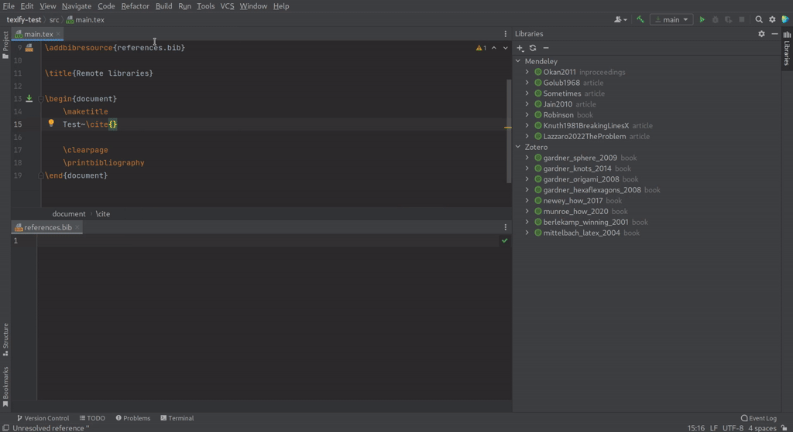

# Tool Windows

## Version control

IntelliJ has version control support for git and others, including a tool window.
For more information, see [Git | IntelliJ IDEA Documentation](https://www.jetbrains.com/help/idea/using-git-integration.html).

## Terminal

IntelliJ has an embedded terminal tool window to run command-line tasks, see [Terminal | IntelliJ IDEA Documentation](https://www.jetbrains.com/help/idea/terminal-emulator.html).

## Remote libraries {id="remote-libraries"}

_Since b0.7.20_

With the Library tool window (located on the right toolbar) it is possible to connect to one of the following remote libraries:

* [Mendeley](https://www.mendeley.com/search/)
* [Zotero](https://www.zotero.org/)

After connecting to a library the contents of this library will be shown in the tool window.
The items from a remote library are available to the autocompletion of `\cite`-like commands the same way bibliography items that are included in a bibliography file are.
When using completion on an item that is not in the bibliography file it will be added by TeXiFy.

**Completion of a bibliography item from a remote library. LaTeX file on top, BibTeX file on bottom, Libraries tool window on the right.**



### Connecting to a library

When connecting to a library, all items from that library will be loaded after the user finishes the setup.
Collections (for Mendeley and Zotero) are currently not supported.

#### Mendeley {id="mendeley"}

When adding a Mendeley library you have to log in to you Mendeley account.
After logging in you can close the dialog by clicking OK.
Clicking cancel or closing the dialog in any other way will cancel the Mendeley setup.
You will be logged in to your Mendeley account until you [remove](Tool-Windows.md#library-remove) the library.

#### Zotero {id="zotero"}

When adding a Zotero library, you need to specify the following information that you can find in your [Zotero settings](https://www.zotero.org/settings):

* User ID. Go to the Feeds/API tab and copy the `<user ID>` where it says `Your userID for use in API calls is <user ID>`.
* User API key. Go to the Feeds/API tab and click `Create new private key`.
  It is important that you keep this key to yourself.

### Syncing a library {id="library-sync"}

When an item is selected, the library where that item belongs to will be synced when pressing the sync button.
When nothing is selected, all libraries will be synced one by one.

### Removing a library {id="library-remove"}

When an item is selected, the library where that item belongs to will be removed when pressing the delete (minus) button.
When nothing is selected, all libraries will be removed.

Currently a library configuration can only be edited by removing and re-adding it.

### What to do when importing the library fails {id="library-error"}
When you get a notification that the library could not be imported completely, the bib file exported by the remote library contains some element that could not be parsed by TeXiFy.
You can export the bib file yourself and open it with TeXiFy to see where the parse error is.
If you can reference the faulty item and compilation works fine then [let us know](https://github.com/Hannah-Sten/TeXiFy-IDEA/issues/new/choose) about the parse error.
When possible, edit the information in the remote library to circumvent the parse error and try again.

## Detexify {id="detexify"}

_Since b0.7.3_

On the right toolbar, you will find the Detexify tool window. This tool window shows a browser with [Detexify](https://detexify.kirelabs.org/classify.html):

> Just draw the symbol you are looking for into the square area and look what happens!

This tool window is only available in a project that contains a LaTeX module.

Please note that Detexify is not developed or maintained by TeXiFy or JetBrains, see http://detexify.kirelabs.org/classify.html for more information and resources.

## Symbols

_Since b0.7.3_

The Symbol tool window will by default anchor to the right tool window pane. Here you will find a wide range of symbols that you can insert by clicking on them. The required package will automatically be imported when clicking the symbol. The symbol gets inserted at the location of your caret in the editor. When you select a symbol like `(...)` or `â` the selected text will be surrounded properly.

The combobox allows you to limit the symbols to specific categories. You can use the search bar to search through the symbols in the selected category. You can search on generated latex/command, package name, short description and category name.

The symbol tool window supports both light and dark mode.


[Demo video](https://user-images.githubusercontent.com/17410729/104858463-ad393d80-591f-11eb-8b3c-2fba54ed05b1.mp4)


## Equation preview

You can use the Equation Preview by making sure your cursor is in a math environment and clicking <ui-path>Tools | LaTeX | Preview Equation</ui-path>, or using <shortcut>Ctrl + Shift + X</shortcut>.

Since version 0.7.11, if you don’t have a custom preamble we use jlatexmath (https://github.com/opencollab/jlatexmath) and it should work out of the box.

If you do have a custom preamble, which jlatexmath does not support, TeXiFy creates a preview by putting your equation in a new temporary (fairly minimal) document and compiling that, and then uses Inkscape to convert to an image.
You may need to have certain fonts installed to make this work.

The current implementation of the Equation Preview was contributed by Sergei Izmailov and requires external dependencies, for which installation instructions follow.
It also relies on system installed fonts, because it converts svg to image, and svg doesn’t include fonts.

Also see the [option to enable continuous preview of math and TikZ environments](TeXiFy-settings.md#option-to-enable-continuous-preview-of-math-and-tikz-environments)

### Installation instructions
This is only necessary if you want to use a custom preamble (using magic comments), or if you have a TeXiFy version older than 0.7.11.

<tabs>
<tab title="Instructions for Linux/MacOS">
<procedure>
<step>Install Inkscape from [inkscape.org/release](https://inkscape.org/release).</step>
<step>If not using Inkscape 1.0 or later, you have to install the `pdf2svg` package for your distro, for example on Ubuntu with `sudo apt-get install pdf2svg` or on Arch Linux with `sudo pacman -S pdf2svg`.</step>
</procedure>
</tab>

<tab title="Instructions for Windows">
<procedure>
<step>Install Inkscape from <a href="https://inkscape.org/release">inkscape.org/release</a>, suppose you install it in <code>C:\Program Files\Inkscape</code>.</step>
<step>If not using Inkscape 1.0 or later, you have to install pdf2svg from <a href="https://github.com/textext/pdf2svg/releases">github.com/textext/pdf2svg/releases</a>, suppose you install it in <code>C:\Program Files\pdf2svg</code>.</step>
<step>Add both <code>C:\Program Files\Inkscape</code> and (if you installed it) <code>C:\Program Files\pdf2svg</code> to your PATH environment variable, for example by searching for Environment Variables on your computer, clicking 'Edit the system environment variables', clicking 'Environment Variables', and under System variables find the one named Path, edit it and insert the paths here. Make sure the paths are separated by a <code>;</code> if using Windows 8 or lower.</step>
<step>Log out and back in.</step>
</procedure>
</tab>
</tabs>

## TikZ preview

You can use the TikZ Preview by placing your cursor in a `tikzpicture` environment and clicking <ui-path>Tools | LaTeX | TikZ Picture Preview</ui-path>, or using <shortcut>Ctrl + Shift + Y</shortcut>.

The TikZ Preview will take TikZ and pgf libraries into account.

The requirements are the same as for the Equation preview.

### Custom preamble for equation and TikZ preview

_Since b.0.6.10_

To include part of your preamble in the equation/TikZ preview, enclose this part with the magic comments `%! begin preamble = tikz` and `%! end preamble = tikz` for the TikZ preview, and `%! begin preamble = math` and `%! end preamble = math` for the math preview.

To include an entire file (for example your `tikzsettings.sty`) in the preamble, put the magic comment `%! preview preamble = tikz` at the start of the file.

For example, to include your custom command `\newcommand{\letters}{\alpha \beta \gamma \delta \epsilon}` in the preamble of the equation preview, use

<!-- ```latex -->
```
\documentclass{article}

%! begin preamble = math
\newcommand{\letters}{\alpha \beta \gamma \delta \epsilon}
%! end preamble = math

\begin{document}
    \[
        x = \letters
    \]
\end{document}
```

### Using the preview on macOS

TeXiFy seems to have problems with running pdflatex, as commented at [#25](https://github.com/Hannah-Sten/TeXiFy-IDEA/issues/25#issuecomment-314573002) this might have to do with PATH problems.
The comment links to [http://depressiverobot.com/2016/02/05/intellij-path.html](http://depressiverobot.com/2016/02/05/intellij-path.html) which has a couple of workarounds, for example using `open -a "IntelliJ IDEA CE"` or `open -a pycharm`. There is also a more permanent workaround.
If you use the Jetbrains Toolbox, you can find the path in the Toolbox under <ui-path>Settings | Tools</ui-path>.

If you do know how we could fix this on the plugin side, please let us know.
