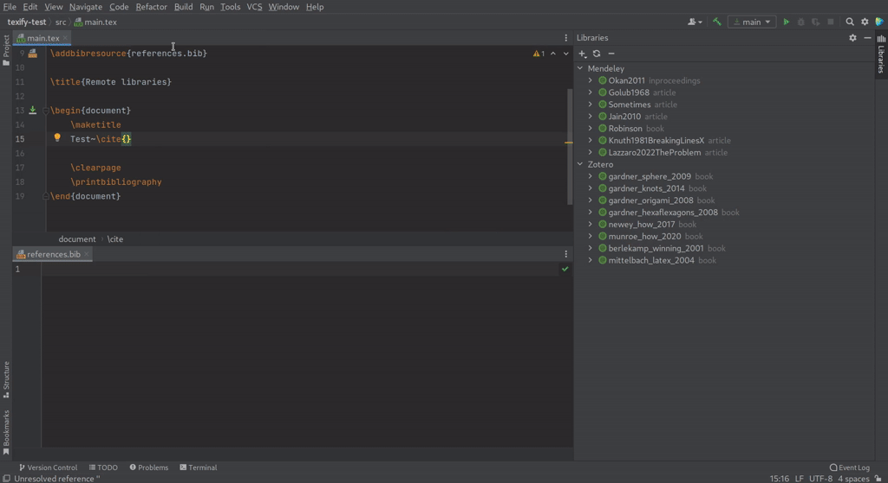

## [[remote-libraries]]Remote libraries

_Since b0.7.20_

With the Library tool window (located on the right toolbar) it is possible to connect to one of the following remote libraries:

* [Mendeley](https://www.mendeley.com/search/)
* [Zotero](https://www.zotero.org/)

After connecting to a library the contents of this library will be shown in the tool window.
The items from a remote library are available to the autocompletion of `\cite`-like commands the same way bibliography items that are included in a bibliography file are.
When using completion on an item that is not in the bibliography file it will be added by TeXiFy.

**Completion of a bibliography item from a remote library. LaTeX file on top, BibTeX file on bottom, Libraries tool window on the right.**

### Connecting to a library

When connecting to a library, all items from that library will be loaded after the user finishes the setup.
Collections (for Mendeley and Zotero) are currently not supported.

#### [[mendeley]]Mendeley

When adding a Mendeley library you have to log in to you Mendeley account.
After logging in you can close the dialog by clicking OK.
Clicking cancel or closing the dialog in any other way will cancel the Mendeley setup.
You will be logged in to your Mendeley account until you [remove](Tools#library-remove) the library.

#### [[zotero]]Zotero

When adding a Zotero library, you need to specify the following information that you can find in your [Zotero settings](https://www.zotero.org/settings):

* User ID. Go to the Feeds/API tab and copy the `<user ID>` where it says `Your userID for use in API calls is <user ID>`.
* User API key. Go to the Feeds/API tab and click `Create new private key`.
    It is important that you keep this key to yourself.

### [[library-sync]]Syncing a library

When an item is selected, the library where that item belongs to will be synced when pressing the sync button.
When nothing is selected, all libraries will be synced one by one.

### [[library-remove]]Removing a library

When an item is selected, the library where that item belongs to will be removed when pressing the delete (minus) button.
When nothing is selected, all libraries will be removed.

Currently a library configuration can only be edited by removing and re-adding it.

### [[library-error]]What to do when importing the library fails
When you get a notification that the library could not be imported completely, the bib file exported by the remote library contains some element that could not be parsed by TeXiFy.
You can export the bib file yourself and open it with TeXiFy to see where the parse error is.
If you can reference the faulty item and compilation works fine then [let us know](https://github.com/Hannah-Sten/TeXiFy-IDEA/issues/new/choose) about the parse error.
When possible, edit the information in the remote library to circumvent the parse error and try again.

## [[detexify]]Detexify

_Since b0.7.3_

On the right toolbar, you will find the Detexify tool window. This tool window shows a browser with [Detexify](https://detexify.kirelabs.org/classify.html):

> Just draw the symbol you are looking for into the square area and look what happens!

This tool window is only available in a project that contains a LaTeX module.

Please note that Detexify is not developed or maintained by TeXiFy or JetBrains, see http://detexify.kirelabs.org/classify.html for more information and resources.
